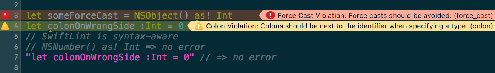
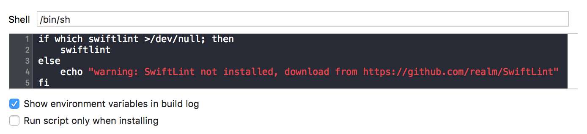

<h1 align="center">
  swiftlint-config-pixelmatters
</h1>

<p align="center">
  
</p>

<h3 align="center">
  An SwiftLint config standard for Pixelmatters iOS projects
</h3>

<p align="center">
  SwiftLint is a tool to enforce Swift style and conventions.
</p>

<p align="center">
  <a href="https://github.com/Pixelmatters/eslint-config-pixelmatters/blob/master/LICENSE">
    
  </a>
  <a href="https://github.com/Pixelmatters/eslint-config-pixelmatters/blob/master/CONTRIBUTING.md">
    
  </a>
  <a href="https://twitter.com/intent/follow?screen_name=pixelmatters_">
    
  </a>
</p>


## 🚀 Installation

### Using [Homebrew](http://brew.sh/):

Simply run the following command in your Terminal: 

```
brew install swiftlint
```

This will install the SwiftLint binaries and dependencies in your machine.

### Using [CocoaPods](https://cocoapods.org):

Simply add the following line to your Podfile:

```ruby
pod 'SwiftLint'
```

This will download the SwiftLint binaries and dependencies in `Pods/` during your next
`pod install` execution and will allow you to invoke it via `${PODS_ROOT}/SwiftLint/swiftlint`
in your Script Build Phases.

This is the recommended way to install a specific version of SwiftLint since it supports
installing a pinned version rather than simply the latest (which is the case with Homebrew).

Note that this will add the SwiftLint binaries, its dependencies' binaries and the Swift binary
library distribution to the `Pods/` directory, so checking in this directory to SCM such as
git is discouraged.

## 🛠️ Usage

After to install, move the file `swiftlint.yml` into the same path of your `Project.xcodeproj`.

### Xcode

Integrate SwiftLint into your Xcode project to get warnings and errors displayed
in the issue navigator.



To do this click the Project in the file navigator, then click the primary app
target, and go to Build Phases. Click the + and select "New Run Script Phase".

### Insert the following as the script for Homebrew setup:

```bash
if which swiftlint >/dev/null; then
 swiftlint --config ".swiftlint.yml"
else
 echo "warning: SwiftLint not installed, use: brew install swiftlint"
fi
```

### Insert the following as the script for CocoaPods setup:

```bash
if which swiftlint >/dev/null; then
  swiftlint
else
  echo "warning: SwiftLint not installed, download from https://github.com/realm/SwiftLint"
fi
```

After that it needs to look like the screenshot:



## 🤝 How to Contribute

Whether you're helping us fix bugs, improve the docs, or spread the word, thank you! 💪 🧡

Check out our [**Contributing Guide**](https://github.com/Pixelmatters/swiftlint-config-pixelmatters/blob/main/CONTRIBUTING.md) for ideas on contributing and setup steps.

## :memo: License

Licensed under the [MIT License](./LICENSE).